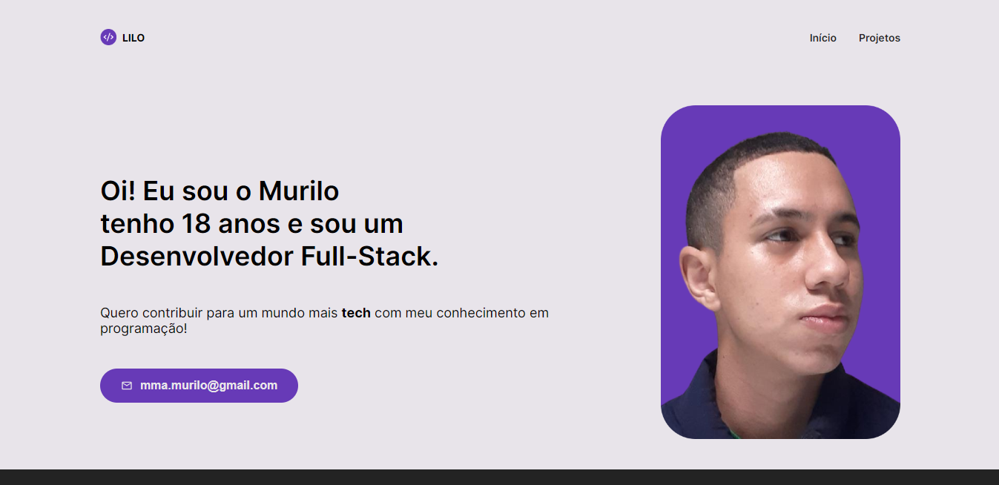

<br />
<div align="center">
  <a href="#">
    
  </a>

  <h3 align="center">Portfólio</h3>

  <p align="center">
    Confira a primeira versão do meu portfólio! 🚀
    <br />
    </div>

<div align="center">


</div>

<h4 align="center"> 
	🚧  Em construção... 🚧
</h4>

<details>
  <summary>Sumário</summary>
  <ol>
    <li>
      <a href="#💻-sobre-o-projeto">Sobre o projeto</a>
    </li>
    <li>
      <a href="#🔍-preview">Preview</a>
    </li>
    <li>
      <a href="#⚙️-rodando-localmente">Rodando localmente</a>
        <li><a href="#🛠-tecnologias-utilizadas">Tecnologias utilizadas</a></li>
    </li>
    <li><a href="#✒️-autor">Autor</a></li>
  </ol>
</details>

## 🔍 Preview



## 💻 Sobre o projeto

<p>Aplicação focada em expor meus projetos em um website personalizado, meu portifólio.
</p>

## ⚙️ Rodando localmente

### Pré-requisitos

```
# Clone o repositório
$ git clone <https://github.com/lilo-afk/Portfolio.git>

# Acesse a pasta do projeto no terminal/cmd
$ cd Portfolio

# Instale as dependências
$ npm i

# Execute a aplicação

$ npm run dev
```

## 🛠 Tecnologias utilizadas


## ✒️ Autor


<a href="https://github.com/lilo-afk" ><sub><b>Lilo-afk</b></sub></a> <a title="Fino señores">🍷</a>

Feito com ❤️ por Murilo Martins Alves 👋🏽 Entre em contato!

[](https://www.linkedin.com/in/victor-silva-9485021b2/)
[](mailto:mma.murilo@gmail.com)
